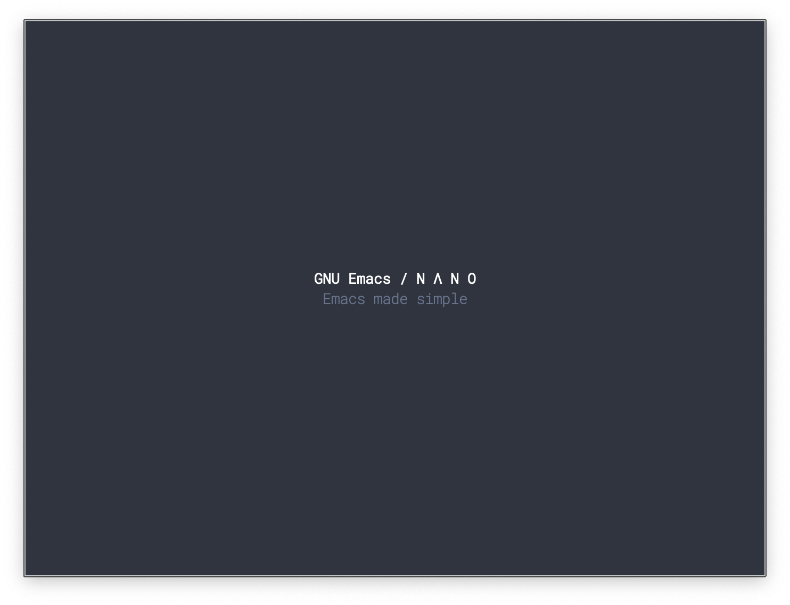

## GNU Emacs / N Λ N O Splash

An alternative splash screen .
Best with [N Λ N O theme](https://github.com/rougier/nano-theme).

<div>


</div>

### Installation

Install with [straight.el](https://github.com/raxod502/straight.el):

```
;; Optional (N Λ N O theme)
(straight-use-package '(nano-theme :type git :host github
                                   :repo "rougier/nano-theme"))

(straight-use-package '(nano-splash :type git :host github
                                   :repo "rougier/nano-splash"))
```

### Usage

Add `(nano-splash)` to your `.emacs.d/init.el`

